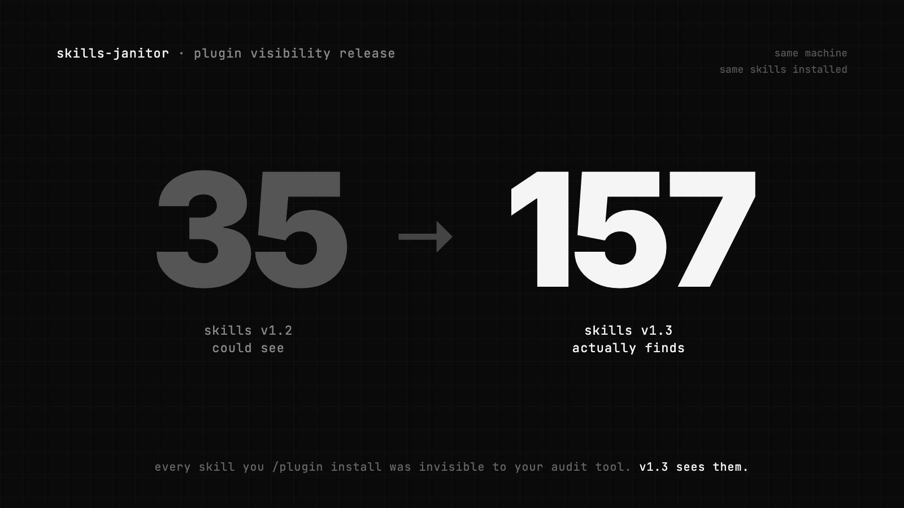

# Skills Janitor

> Audit and clean up your Claude Code skills. 4 commands, zero dependencies.

Works with **Claude Code** and **OpenAI Codex**.



Scans every place a skill lives: user, project, codex, and (as of v1.3) every skill installed via `/plugin install`. Surfaces duplicates, broken symlinks, and unused skills cluttering your context.

## Commands

| Command | What it does |
|---|---|
| `/janitor-report` | Health check: inventory, duplicates, broken skills. `--brief` for inventory only. |
| `/janitor-fix` | Auto-fix issues. `--prune` removes broken symlinks and empty dirs. |
| `/janitor-value` | Combined token + usage view, sorted by waste. |
| `/janitor-discover` | Search GitHub for skills, or check a URL before installing. |

Each has its own slash command. Or use natural language: *"check my skills"*, *"which skills are wasting context?"*, *"find an n8n skill"*.

## Install

```
/plugin marketplace add khendzel/skills-janitor
/plugin install skills-janitor
```

Or clone directly:

```bash
git clone https://github.com/khendzel/skills-janitor ~/.claude/skills/skills-janitor
```

## What v1.3 catches that v1.2 missed

The duplicate detector now flags cross-scope overlaps that were invisible before:

```
=== Skills Janitor - Duplicate Detection ===

--- Description Overlap (Jaccard > 30%) ---

  [98%] marketing-seo-audit <-> marketing-skills:seo-audit
        Scopes: user / plugin

  [100%] marketing-content-strategy <-> marketing-skills:content-strategy
        Scopes: user / plugin
```

If you installed a plugin that re-implements a skill you already had standalone, v1.3 tells you. v1.2 couldn't, because it was blind to the plugin tree entirely.

## v1.2 → v1.3 migration

The five v1.2 commands keep working as deprecated aliases until v1.4. Renames:

| v1.2 | v1.3 |
|---|---|
| `/janitor-audit` | `/janitor-report --brief` |
| `/janitor-usage` | `/janitor-value` |
| `/janitor-tokens` | `/janitor-value` |
| `/janitor-search` | `/janitor-discover` |
| `/janitor-precheck` | `/janitor-discover <url>` |

Full release notes: [CHANGELOG.md](CHANGELOG.md).

## Requirements

Bash, Python 3, `curl`. No pip installs, no node modules.

## Contributing

PRs welcome. Each command is self-contained in `skills/janitor-*/SKILL.md` plus a sibling script in `scripts/`.

## License

MIT
